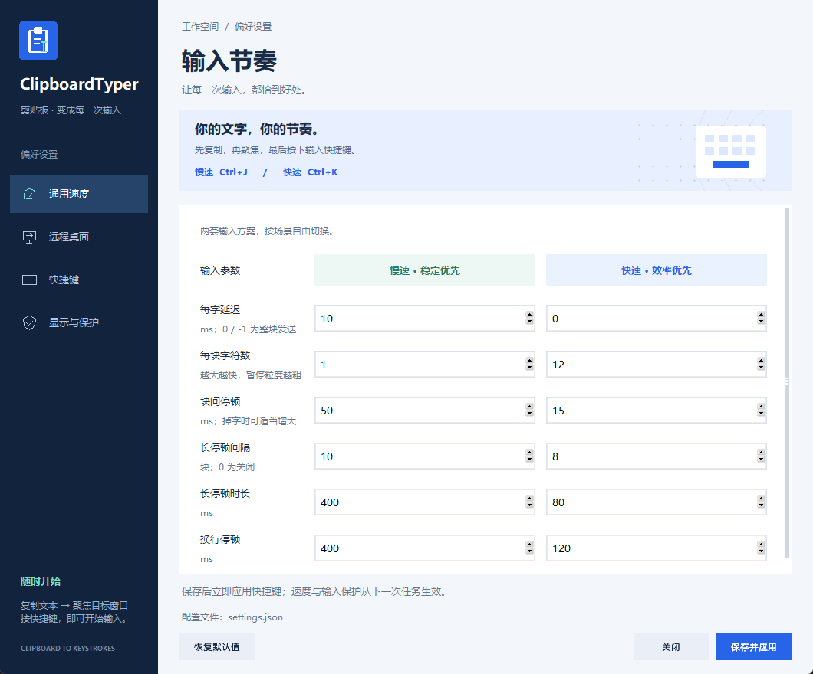

# 界面与品牌资源

设置窗口采用深蓝侧栏、浅色工作区和蓝色主操作按钮。薄荷绿用于 Logo 光标、当前导航图标和慢速方案提示。导航支持鼠标与键盘，表单在小窗口中滚动，底部保存操作始终可见。

- `src/clipboard_typer/ui/branding.py`：共享配色、剪贴板 Logo 几何定义和导航图标。
- `src/clipboard_typer/assets/`：SVG、32/64/256 像素 PNG，以及包含 16–256 像素七种尺寸的 Windows ICO。
- `scripts/generate_brand_assets.py`：仅用 Python 标准库重新生成品牌资源；无需额外绘图库。
- `src/clipboard_typer/ui/settings.py`：几何背景、键盘插画和开关控件，随窗口和显示缩放适配。

运行 `python scripts/generate_brand_assets.py` 可从共享几何定义重建资源。PNG 采用多重采样抗锯齿；SVG 可用于后续设计编辑。托盘、状态浮窗和设置窗口共享品牌标识，`build_exe.bat` 会将图标嵌入 EXE 并收集运行时资源。Python wheel 同样包含这些资源。

